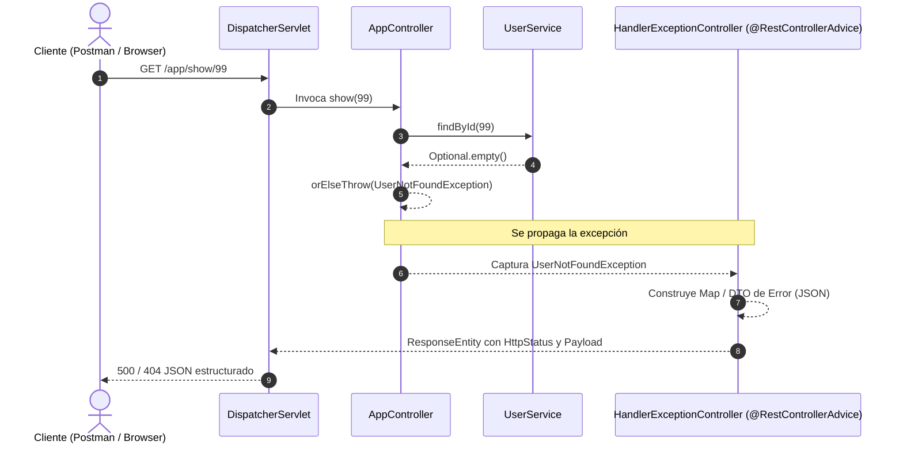

# 🛡️ Spring Boot - Manejo Global de Errores y Excepciones

<div align="center">


<p align="center">
  <b>API REST desarrollada en Spring Boot orientada a la centralización, captura y estandarización del manejo de excepciones mediante <code>@RestControllerAdvice</code> y <code>@ExceptionHandler</code>.</b>
</p>

</div>

---

## 📋 Tabla de Contenidos

- [🎯 Acerca del Proyecto](#-acerca-del-proyecto)
- [✨ Características Principales](#-características-principales)
- [🏗️ Arquitectura y Flujo de Excepciones](#️-arquitectura-y-flujo-de-excepciones)
- [📁 Estructura del Proyecto](#-estructura-del-proyecto)
- [🛠️ Stack Tecnológico](#️-stack-tecnológico)
- [⚙️ Configuración del Sistema](#️-configuración-del-sistema)
- [🚀 Endpoints de la API](#-endpoints-de-la-api)
- [🧩 Matriz de Manejo de Excepciones](#-matriz-de-manejo-de-excepciones)
- [💻 Guía de Instalación y Ejecución](#-guía-de-instalación-y-ejecución)
- [🧪 Pruebas Rápidas con cURL](#-pruebas-rápidas-con-curl)
- [👤 Autor](#-autor)

---

## 🎯 Acerca del Proyecto

En el desarrollo de APIs REST profesionales, devolver trazas de error sin formato (*stack traces*) o páginas de error por defecto de Tomcat/Spring representa un riesgo de seguridad y una mala experiencia para el cliente.

Este proyecto implementa una solución robusta y desacoplada para interceptar excepciones en tiempo de ejecución, transformándolas en respuestas HTTP consistentes con payloads JSON estandarizados (DTOs de error), manejando tanto errores de negocio (usuario no encontrado) como errores técnicos de la aplicación (divisiones por cero, formatos numéricos inválidos y rutas 404 no mapeadas).

---

## ✨ Características Principales

- **Manejo Global Desacoplado**: Uso de `@RestControllerAdvice` para capturar excepciones sin ensuciar los controladores con bloques `try-catch`.
- **Estructuración Uniforme de Errores**: Retorno de DTOs (`Error.java`) y estructuras clave-valor con fecha, mensaje descriptivo, tipo de error y código de estado HTTP.
- **Excepciones de Negocio Personalizadas**: Definición de `UserNotFoundException` para representar estados donde recursos solicitados no existen.
- **Captura Avanzada de Rutas 404**: Configuración de Spring MVC para capturar `NoHandlerFoundException` cuando el cliente consulta endpoints inexistentes.
- **Inyección y Programación Funcional**: Uso de `Optional<T>`, Streams y lambdas (`orElseThrow`) para una gestión limpia de ausencia de valores en capas de servicio.

---

## 🏗️ Arquitectura y Flujo de Excepciones

El siguiente diagrama ilustra cómo fluye una petición HTTP y cómo el interceptor global captura y modela la respuesta ante cualquier falla:



---

## 📁 Estructura del Proyecto

```text
springboot-error/
├── src/
│   ├── main/
│   │   ├── java/com/gustavo/curso/springboot/error/springboot_error/
│   │   │   ├── SpringbootErrorApplication.java   # Clase principal (Bootstrap)
│   │   │   ├── AppConfig.java                    # Configuración de Beans (usuarios en memoria)
│   │   │   │
│   │   │   ├── controllers/
│   │   │   │   ├── AppController.java            # Endpoints REST de la aplicación
│   │   │   │   └── HandlerExceptionController.java # Manejador global @RestControllerAdvice
│   │   │   │
│   │   │   ├── exceptions/
│   │   │   │   └── UserNotFoundException.java    # Excepción custom de dominio
│   │   │   │
│   │   │   ├── models/
│   │   │   │   ├── Error.java                    # DTO para respuesta estandarizada de errores
│   │   │   │   └── domain/
│   │   │   │       ├── User.java                 # Modelo de Usuario
│   │   │   │       └── Role.java                 # Modelo de Rol
│   │   │   │
│   │   │   └── services/
│   │   │       ├── UserService.java              # Interfaz de servicio de usuarios
│   │   │       └── UserServiceImpl.java          # Implementación con Streams y búsqueda
│   │   │
│   │   └── resources/
│   │       └── application.properties            # Propiedades del servidor y Spring MVC
│   └── test/                                     # Pruebas unitarias y de integración
├── pom.xml                                       # Dependencias de Maven y configuración de build
└── README.md                                     # Documentación del proyecto
```

---

## 🛠️ Stack Tecnológico

| Tecnología | Versión | Propósito |
| :--- | :--- | :--- |
| **Java** | 17 | Lenguaje base del proyecto |
| **Spring Boot** | 4.x / 3.x | Framework backend para microservicios y REST APIs |
| **Spring Web MVC** | Incluido | Mapeo de rutas HTTP, controladores y serialización JSON |
| **Spring Boot Actuator** | Incluido | Monitoreo y métricas de salud de la aplicación |
| **Spring Boot DevTools** | Opcional | Recarga en caliente en entorno de desarrollo |
| **Apache Maven** | 3.9+ | Gestor de dependencias y ciclo de vida de construcción |

---

## ⚙️ Configuración del Sistema

En `src/main/resources/application.properties` se configuran las banderas necesarias para delegar el control total de los errores 404 al `@RestControllerAdvice`:

```properties
spring.application.name=springboot-error

# Lanza NoHandlerFoundException en lugar de dirigir a la página de error por defecto
spring.mvc.throw-exception-if-no-handler-found=true

# Desactiva el mapeo de recursos estáticos por defecto para permitir la captura del 404
spring.web.resources.add-mappings=false
```

> [!NOTE]
> Al deshabilitar `add-mappings`, cualquier ruta no declarada explícitamente disparará `NoHandlerFoundException`, permitiendo que el handler personalizado entregue una respuesta JSON normalizada.

---

## 🚀 Endpoints de la API

La aplicación expone los siguientes endpoints bajo el prefijo `/app`:

| Método | Endpoint | Parámetros | Descripción |
| :--- | :--- | :--- | :--- |
| `GET` | `/app` | Ninguno | Endpoint de prueba para operaciones aritméticas / parsing |
| `GET` | `/app/show/{id}` | `id` (Long, PathVariable) | Consulta de usuario por identificador único |

---

## 🧩 Matriz de Manejo de Excepciones

El controlador global `HandlerExceptionController` captura y transforma los siguientes escenarios:

| Excepción Interceptada | Código HTTP | Origen / Causa | Formato de Respuesta |
| :--- | :---: | :--- | :--- |
| `ArithmeticException` | `500 INTERNAL_SERVER_ERROR` | Operación matemática inválida (ej. división por cero) | Objeto `Error` (DTO) |
| `NumberFormatException` | `500 INTERNAL_SERVER_ERROR` | Conversión fallida de String a valor numérico | `Map<String, Object>` |
| `UserNotFoundException` | `500 INTERNAL_SERVER_ERROR` | Búsqueda de usuario con ID inexistente | `Map<String, Object>` |
| `NullPointerException` | `500 INTERNAL_SERVER_ERROR` | Referencia o propiedad no inicializada | `Map<String, Object>` |
| `NoHandlerFoundException` | `404 NOT_FOUND` | Ruta no registrada en la aplicación | Objeto `Error` (DTO) |

---

## 🧪 Pruebas Rápidas con cURL

A continuación se presentan ejemplos prácticos para interactuar y comprobar el funcionamiento de las respuestas y excepciones:

### 1. Consulta exitosa de un usuario
```bash
curl -X GET http://localhost:8080/app/show/2
```
**Respuesta esperada (200 OK):**
```json
{
  "id": 2,
  "name": "Gustavo",
  "lastaname": "Flores",
  "role": null
}
```

---

### 2. Usuario no encontrado (`UserNotFoundException`)
```bash
curl -X GET http://localhost:8080/app/show/999
```
**Respuesta esperada:**
```json
{
  "date": "2026-09-24T19:30:00.000+00:00",
  "error": "El usuario rol no existe!",
  "message": "Error el usuario no existe",
  "status": 500
}
```

---

### 3. Ruta no encontrada (`NoHandlerFoundException` - 404)
```bash
curl -X GET http://localhost:8080/app/ruta-inexistente
```
**Respuesta esperada (404 NOT FOUND):**
```json
{
  "message": "No endpoint GET /app/ruta-inexistente.",
  "error": "Ruta de la api no encontrada",
  "status": 404,
  "date": "2026-09-24T19:30:00.000+00:00"
}
```

---

### 4. Endpoint base
```bash
curl -X GET http://localhost:8080/app
```
**Respuesta esperada (200 OK):**
```text
200 ok
```

---

## 💻 Guía de Instalación y Ejecución

### Prerrequisitos

- **Java JDK 17** o superior instalado y configurado en el `PATH`.
- **Git** para clonar el repositorio.
- *(Opcional)* **Maven 3.9+** (el proyecto incluye el wrapper `mvnw`).

### Pasos para ejecutar

1. **Clonar el repositorio:**
   ```bash
   git clone https://github.com/GusDev071/Springboot-Manejo-de-Errores.git
   cd Springboot-Manejo-de-Errores
   ```

2. **Compilar el proyecto:**
   - En Linux/macOS:
     ```bash
     ./mvnw clean compile
     ```
   - En Windows (PowerShell / CMD):
     ```powershell
     .\mvnw.cmd clean compile
     ```

3. **Iniciar la aplicación:**
   - En Linux/macOS:
     ```bash
     ./mvnw spring-boot:run
     ```
   - En Windows (PowerShell / CMD):
     ```powershell
     .\mvnw.cmd spring-boot:run
     ```

4. **Verificar el servicio:**
   La aplicación se iniciará por defecto en el puerto `8080`. Puedes abrir tu navegador o terminal y acceder a:
   ```text
   http://localhost:8080/app
   ```

---

## 👤 Autor

Desarrollado por **Gustavo Flores**  
- GitHub: [@GusDev071](https://github.com/GusDev071)
